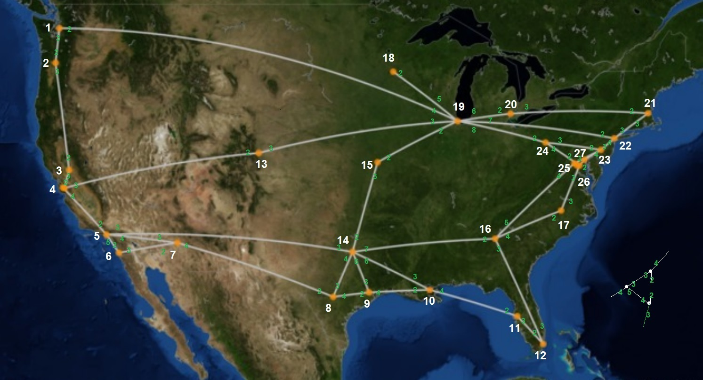

# LightINT
The repository contains the code to implement three distinct In-Band Network Telemetry (INT) methods using P4-enabled switches.

<ul>
  <li>DLINT: Deterministic Lightweight INT</li>
  <li>PLINT: Probabilistic Lightweight INT</li>
  <li>CLINT: Controller-assisted Lightweight INT</li>  
</ul>

The methods are described in the following two scientific papers:

Papadopoulos, K., Papadimitriou, P., & Papagianni, C. (2023). <b>Deterministic and Probabilistic P4-Enabled Lightweight In-Band Network Telemetry</b>. IEEE Transactions on Network and Service Management. (https://ieeexplore.ieee.org/document/10206040)

Papadopoulos, K., & Papadimitriou, P. (2024). <b>CLINT: Controller-Assisted Lightweight In-Band Network Telemetry. IEEE Access.</b> (https://ieeexplore.ieee.org/document/10493019)

# Installation

To install you need a fresh instance of Ubuntu 20. A desktop version is preferable so that GUI tools (such as Wireshark) can be used.

Open a terminal and issue the following commands. Keep the directory structure.

<ul>
  <li>sudo apt update</li>
  <li>sudo apt upgrade</li>
  <li>sudo apt install git</li>
  <li>git clone https://github.com/jafingerhut/p4-guide.git</li>
  <li>./p4-guide/bin/install-p4dev-v5.sh #(This should take some minutes)</li>
  <li>sudo apt install d-itg</li>
  <li>git clone https://github.com/p4lang/tutorials.git</li>
  <li>cd tutorials</li>
  <li>git reset --hard aa58e1247d69455e7e330273edd00c68e0810572</li>
  <li>cd ..</li>
  <li>git clone https://github.com/kpapd/LightINT.git</li>
</ul>

# Use

# DLINT

The program simulates a network in Mininet with 27 nodes using BMv2 P4 software switch.

In its initial state, a single TCP flow is generated from node 1 to node 12.

The topology and the experiment can be triggered with the following commands:

<ul>
  <li>cd LightINT/DLINT-PINT</li>
  <li>sudo bash runexp.sh dlint1 1/1 0 3281 30</li>
</ul>

The general syntax is:
runexp [type&TelValuesPerPacket=dlintX/plintX] [referenceLabel=X] [puthUpdate=0/1] [bfSize] [PU time]
<ul>
  <li>type&TelValuesPerPacket: Method to use (dlint/plint) and number of telemetry values per packet (1-5)</li>
  <li>referenceLabel: This is just a label to print in case of multiple experiments (put an arbitrary string</li>
  <li>puthUpdate: Whether to update the path amid the experiment (0/1)</li>
  <li>bfSize: Size of the Bloom Filter (larger BF - less collisions, more accurate results)</li>
  <li>PU time: The time where the path update takes place (applicable when pathUpdate=1)</li>
</ul>

The experiment runs for 60 seconds and outputs overall statistics.

To trigger multiple flows in more paths, comment out the corresponding lines of code starting with "#BTN", in experiment.py

The following command will trigger a path update in all paths, in the 30th second:

<ul>
  <li>sudo bash runexp.sh dlint1 1/1 1 3281 30</li>
</ul>

# PLINT

To launch a PLINT experiment issue the following:

<ul>
  <li>sudo bash runexp.sh plint1 1/1 0 3281 30</li>
</ul>

bfSize parameter (3821) doesn't apply in this case.

To add a path update in the 30th second:

<ul>
  <li>sudo bash runexp.sh plint1 1/1 0 3281 30</li>
</ul>

# CLINT

CLINT uses a controller to coordinate switches.

The following commands will start an experiment without and with a path update:

<ul>
  <li>cd LightINT/CLINT</li>
  <li>sudo sh runexp.sh clint1 100% 0 4081</li>
  <li>sudo sh runexp.sh clint1 100% 1 4081</li>
</ul>

bfSize in this case is the size of the register Array.

# Notes

Running experiments with multiple flows requires more CPU and memory resources. Use with caution with respect to the underlying hardware. TCP flow rate should also be considered.

The compiled version of BMv2 used in this repository is not optimized for performance rather than for educational and testing purposes. Better performance can be achieved by compiling BMv2 with parameters optimized for performance.

We are thankfull to the creators and contributors of the following repositories: jafingerhut/p4-guide, p4lang/behavioral-model, p4lang/tutorials, where more information can be found.

